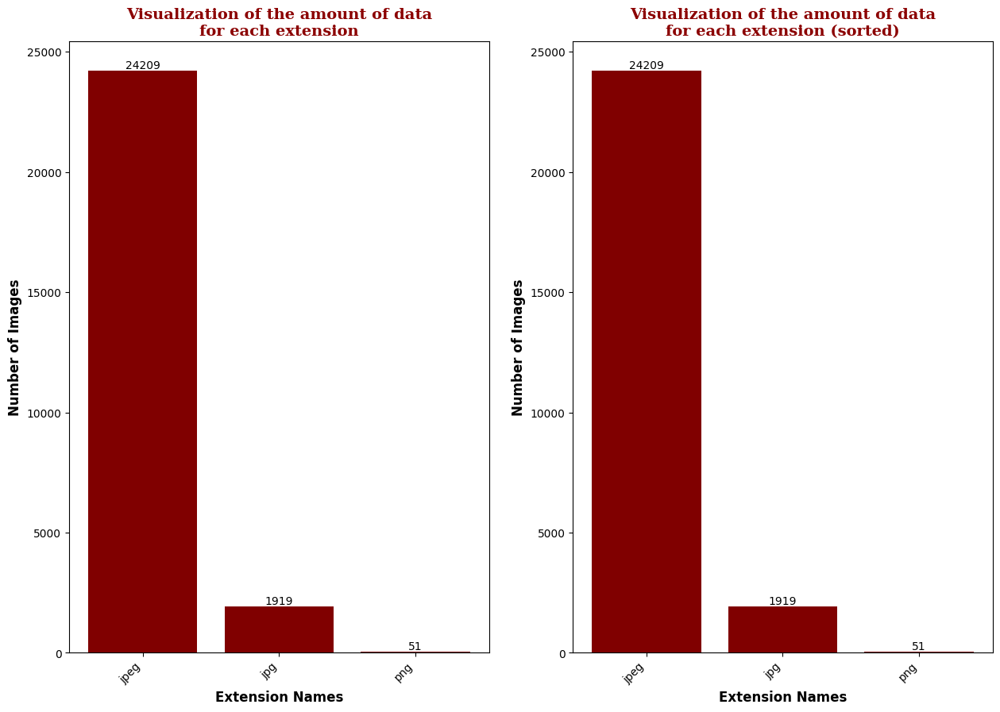

# Computer Vision Project: Animal-10 Classification

Проект з класифікації зображень тварин за допомогою нейронних мереж. Метою є побудова моделі, яка здатна класифікувати зображення тварин на основі датасету "Animals-10", що містить зображення 10 різних видів тварин. Таких як:
```text
data classes: ['cane', 'cavallo', 'elefante', 'farfalla', 'gallina', 'gatto', 'mucca', 'pecora', 'ragno', 'scoiattolo'], number of classes: 10
data classes: ['dog', 'horse', 'elephant', 'butterfly', 'chicken', 'cat', 'cow', 'sheep', 'spider', 'squirrel'], number of classes: 10
```

## Опис проекту
Цей проект включає наступні етапи:
1. Підготовка середовища для тренування моделі.
2. Завантаження і обробка датасету "Animals-10".
3. Проведення аналізу даних, включаючи аугментацію та візуалізацію.
4. Розробка архітектури нейронної мережі для класифікації зображень.
5. Тренування моделі та оцінка її ефективності.

## Опис датасету "Animals-10"
- **Кількість зображень**: 26179.
- **Кількість класів**: 10.
- **Якість зображень**: середня.
- **Кількість зображень по класах**: від 1446 до 4863 зображень.
```python
{
     'cane': 4863,
     'ragno': 4821,
     'gallina': 3098,
     'cavallo': 2623,
     'farfalla': 2112,
     'mucca': 1866,
     'scoiattolo': 1862,
     'pecora': 1820,
     'gatto': 1668,
     'elefante': 1446
 }
```

Цей датасет можна використовувати для тестування моделей розпізнавання зображень, таких як домашні CNN (які можуть досягати точності близько 80%) або більш складні моделі, як Google Inception (яка досягла 98% точності). Датасет також може бути корисним для симуляції розумної галереї для дослідників, таких як біологи, для автоматичного розпізнавання видів тварин.
### Структура каталогу:
```text
Animals-10/raw-img/
│
├── cane/
│   ├── image_001.jpg
│   ├── ...
│   └── image_n.jpg
│
├── cavallo/
│   ├── image_001.jpg
│   ├── ...
│   └── image_n.jpg
│
├── elefante/
│   ├── image_001.jpg
│   ├── ...
│   └── image_n.jpg
│
├── farfalla/
│   ├── image_001.jpg
│   ├── ...
│   └── image_n.jpg
│
├── gallina/
│   ├── image_001.jpg
│   ├── ...
│   └── image_n.jpg
│
├── gatto/
│   ├── image_001.jpg
│   ├── ...
│   └── image_n.jpg
│
├── mucca/
│   ├── image_001.jpg
│   ├── ...
│   └── image_n.jpg
│
├── pecora/
│   ├── image_001.jpg
│   ├── ...
│   └── image_n.jpg
│
├── ragno/
│   ├── image_001.jpg
│   ├── ...
│   └── image_n.jpg
│
└── scoiattolo/
│   ├── image_001.jpg
│   ├── ...
│   └── image_n.jpg
```

### Формати файлів



## Аналіз якості даних:
```text
number of corrupted images: 0
number of duplicates: 0
```

## Візуалізація даних:

