# Ручне налаштування
### batch size = 32 and learning rate = 0.01
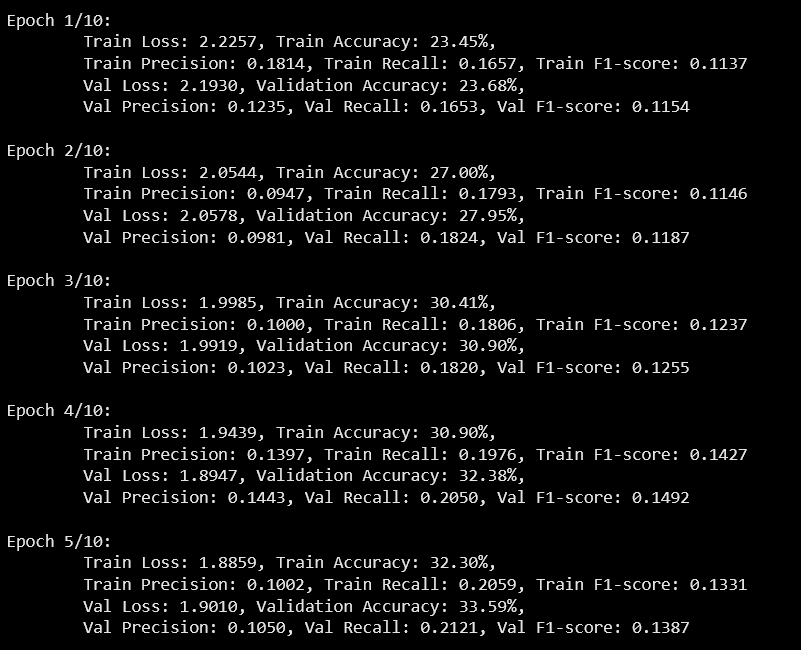
### batch size = 32 and learning rate = 0.001
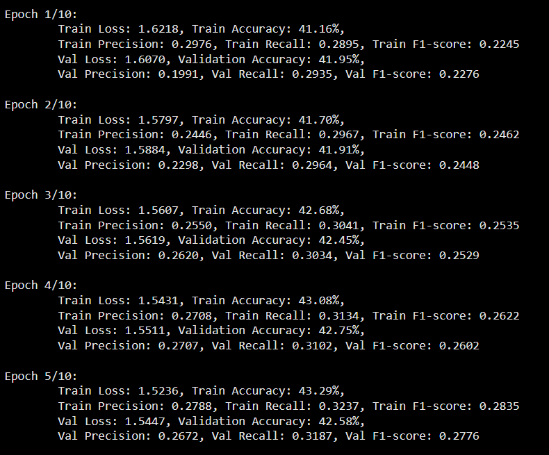
### batch size = 32 and learning rate = 0.0001
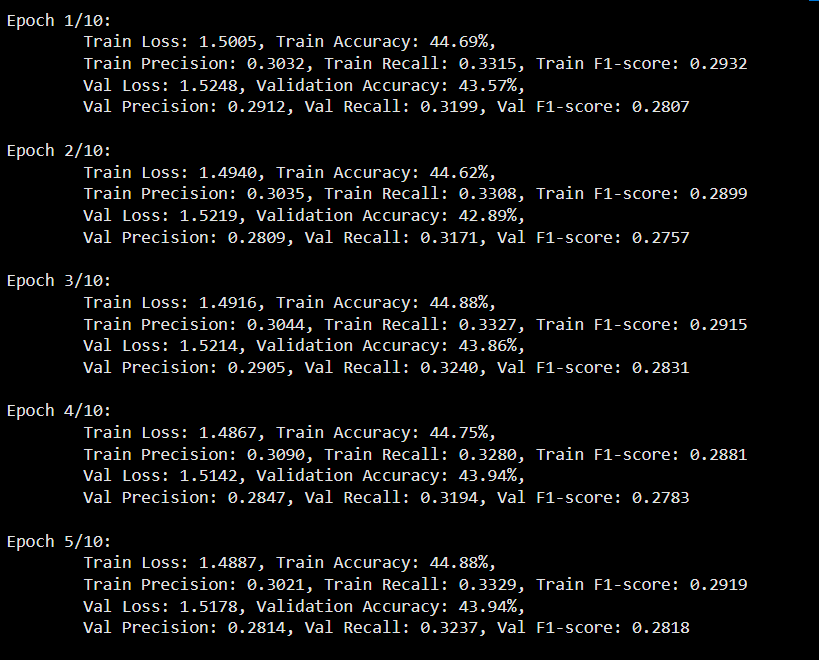
### batch size = 64 and learning rate = 0.01
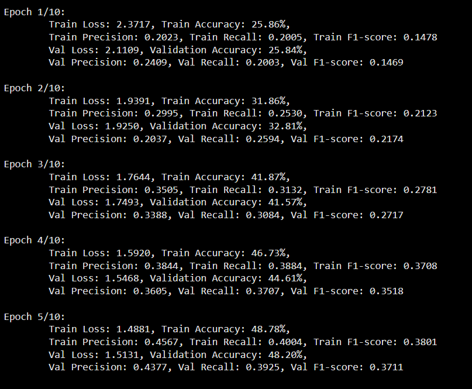
### batch size = 64 and learning rate = 0.001
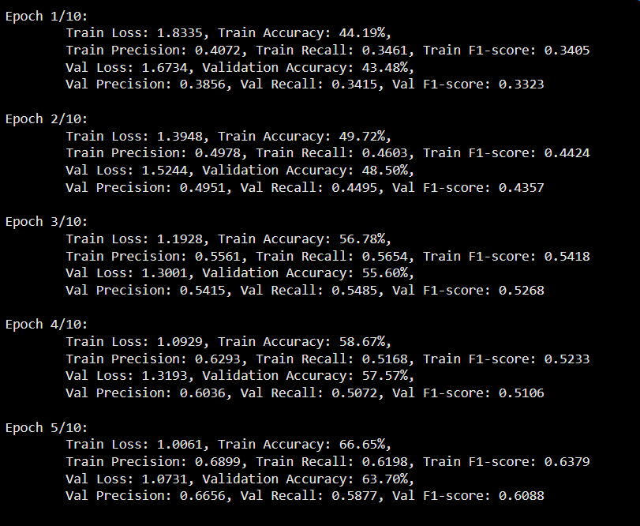
### batch size = 128 and learning rate = 0.01
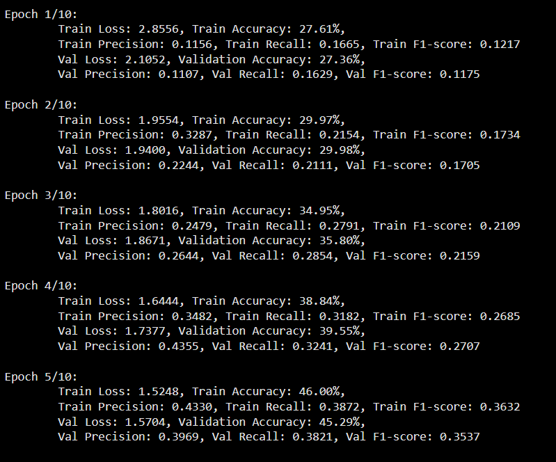
### batch size = 128 and learning rate = 0.001
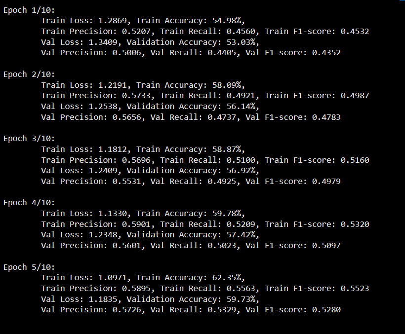
## Висновки: 
було протестовано декілька варіантів комбінацій кроку навчання та розміру батчу і я помітила, що чим менший learning rate тим повільніше збільшується точність і найбільш оптимальним вважаю learning rate = 0.001. що стосується розміру батчу, то найоптимальнішим я вважаю batch size = 64 по швидкості.

## Модель
Я робила експерименти над кількістю шарів та нейронів під час виконання минулої практичної та дійшла до такої архітектури:
```python
class CNNModel(nn.Module):
    def __init__(self, num_classes=10, in_channels=3, filters=[32, 64, 128, 256], fc_units=[512, 256, 128]):
        super(CNNModel, self).__init__()

        self.conv1 = nn.Conv2d(in_channels, filters[0], kernel_size=3, padding=1)
        self.bn1 = nn.BatchNorm2d(filters[0])
        self.pool1 = nn.MaxPool2d(kernel_size=2, stride=2)

        self.conv2 = nn.Conv2d(filters[0], filters[1], kernel_size=3, padding=1)
        self.bn2 = nn.BatchNorm2d(filters[1])
        self.pool2 = nn.MaxPool2d(kernel_size=2, stride=2)

        self.conv3 = nn.Conv2d(filters[1], filters[2], kernel_size=3, padding=1)
        self.bn3 = nn.BatchNorm2d(filters[2])
        self.pool3 = nn.MaxPool2d(kernel_size=2, stride=2)

        self.conv4 = nn.Conv2d(filters[2], filters[3], kernel_size=3, padding=1)
        self.bn4 = nn.BatchNorm2d(filters[3])
        self.pool4 = nn.MaxPool2d(kernel_size=2, stride=2)

        self._to_linear = None
        self.convs(torch.zeros(1, in_channels, 64, 64))

        self.fc1 = nn.Linear(self._to_linear, fc_units[0])
        self.fc2 = nn.Linear(fc_units[0], fc_units[1])
        self.fc3 = nn.Linear(fc_units[1], fc_units[2])
        self.fc4 = nn.Linear(fc_units[2], num_classes)

    def convs(self, x):
        x = F.relu(self.conv1(x))
        x = self.bn1(x)
        x = self.pool1(x)
        x = F.relu(self.conv2(x))
        x = self.bn2(x)
        x = self.pool2(x)
        x = F.relu(self.conv3(x))
        x = self.bn3(x)
        x = self.pool3(x)
        x = F.relu(self.conv4(x))
        x = self.bn4(x)
        x = self.pool4(x)

        if self._to_linear is None:
            self._to_linear = x.view(x.size(0), -1).size(1)
        return x

    def forward(self, x):
        x = self.convs(x)
        x = torch.flatten(x, 1)
        x = F.relu(self.fc1(x))
        x = F.relu(self.fc2(x))
        x = F.relu(self.fc3(x))
        x = self.fc4(x)
        return x
```
Після тренування моделі з підібраними вручну гіперпараметрами маємо такі графіки:
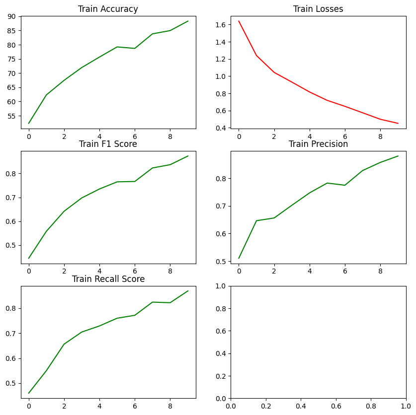
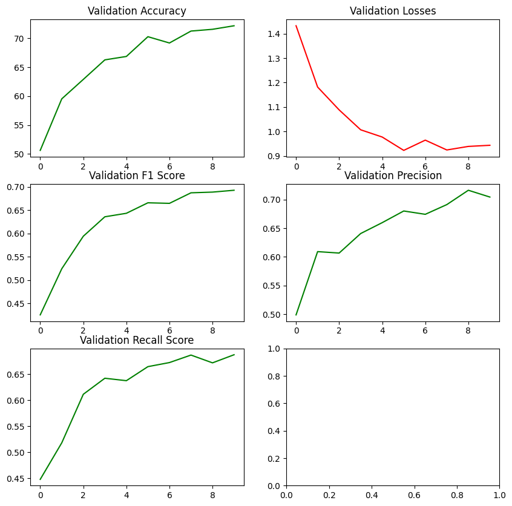

Після тренування моделі з підібраними автоматично гіперпараметрами маємо такі графіки:
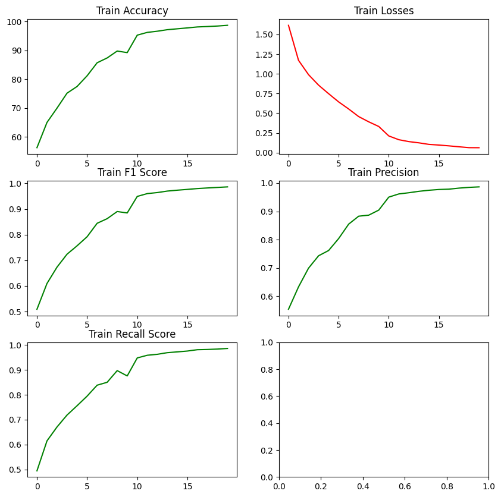
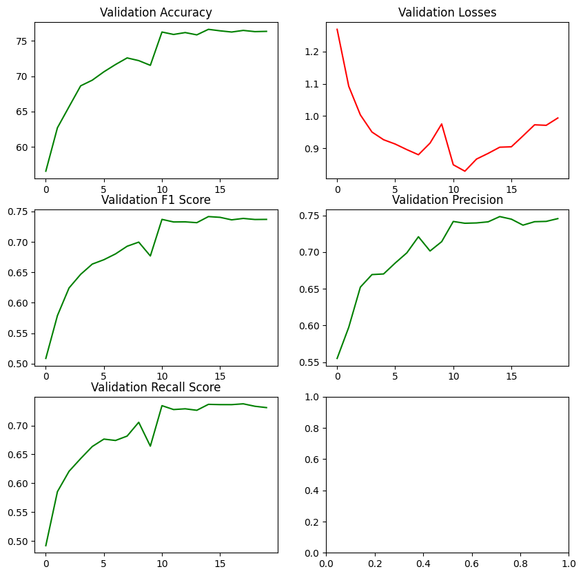
Порівняння матриць плутанини

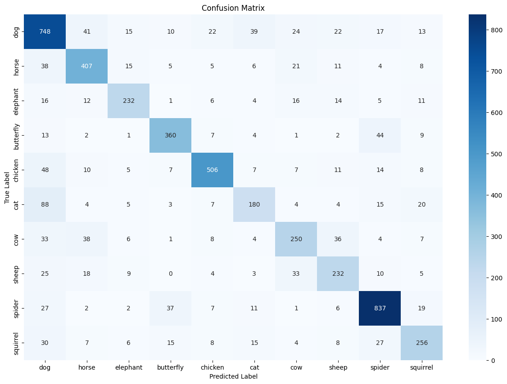